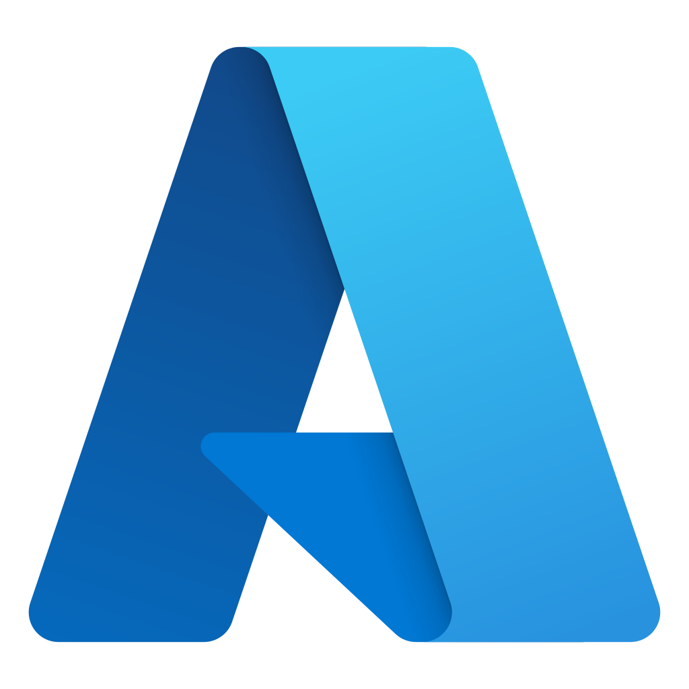
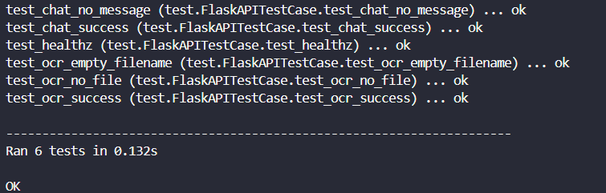
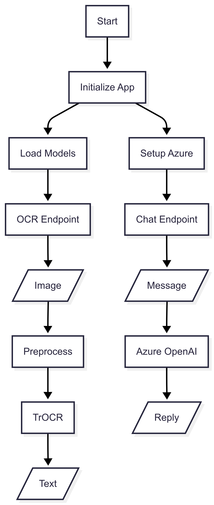

# CalisFun AI Repository Documentation

> [!TIP]
> 
> To make it clear, this repository is just for [Local Development] only. The deployed AI Feature is made in Backend Repository. So this repository is for development testing due to expensive server to deploy the AI Model.

---

## 📃 Table of Contents
- [⚙️ Technology Stack](#-technology-stack)
- [🧩 Core Features](#-core-features)
- [🏗️ Clean Architecture](#-clean-architecture)
- [🧪 Test Coverage](#-test-coverage)
- [🔐 .env Configuration](#-env-configuration)
- [🧰 Getting Started Locally](#-getting-started-locally)
- [🧭 Flowchart Diagram](#-flowchart-diagram)
- [📝 Important Notes](#-important-notes)
- [👥 Owner](#-owner)
- [📬 Contact](#-contact)

---

## ⚙️ Technology Stack

<div align="center">

<kbd></kbd>
<kbd></kbd>
<kbd></kbd>
<kbd></kbd>
<kbd></kbd>

</div>

<div align="center">
<h4>Python | Flask | Hugging Face | Microsoft Azure | OpenAI</h4>
</div>

---

## 🧩 Core Features

### 🖼️ Image OCR (Microsoft TrOCR)
- Input: file gambar (PNG/JPG) atau base64.
- Output: teks hasil OCR + confidence (opsional) + detil waktu proses.
- Model default: `microsoft/trocr-base-printed`
- Penggunaan: deteksi huruf/kata dari lembar latihan tulis anak atau kartu kosakata.

### 💬 Chatbot (Azure OpenAI Model)
- Input: pertanyaan dari pengguna (bisa tentang apapun)
- Output: respon dari AI Chatbot yang menggunakan model OpenAI-35

---

## 🏗️ Clean Architecture

### Repository Structure

```
calis-fun-ai/
├── app.py                      # Main Flask app (thin entry point)
├── test.py                     # For running the test coverage
├── requirements.txt            # Core dependencies
│
├── src/                        # All AI logic
│   ├── image-ocr/              # OCR domain
│   ├── chatbot/                # Chatbot domain
│
├── frontend-testing/           # Local frontend experiments
│
├── docker/
│   ├── Dockerfile              # Optimized for production
│   └── .dockerignore           # For local testing
│
```

### **Architecture Principles**

The architecture that we used for the AI Repository is **Pragmatic Layered Architecture** that balances simplicity with testability.

1. **Layered Separation**
    - `app.py`: Thin routing layer (only HTTP handling)
    - `src/`: Business logic and AI services (for development)
    - `test.py`: Isolated test suites
2. **Domain-Centric**
    - OCR and chatbot as separate domains

---

## 🧪 Test Coverage

We already succedd to locally run the image ocr using Microsoft Pre-tuned Model and Chatbot using Azure OpenAI Chatbot Model. We also already tested it using mockup library in Python




---

## 🔐 .env Configuration

.env for the AI
```
AZURE_OPENAI_KEY=...
AZURE_OPENAI_ENDPOINT=https://<your-azure-openai>.openai.azure.com/
AZURE_API_VERSION=2024-06-01 # Example
AZURE_OPENAI_DEPLOYMENT=gpt-35-turbo

PORT=5000
CORS_ALLOW_ORIGINS=*
MAX_UPLOAD_MB=10

TROCR_MODEL_ID=microsoft/trocr-base-printed
MODEL_CACHE_DIR=/app/image-ocr/trocr_cache
```

You can also copy the .env.sample then rename it to .env and update your .env file

---

## 🧰 Getting Started Locally

### Prerequisites
- **Python**
- **Docker** (optional)
- **Git**

### Clone the Project
```bash

# Cloning Repo
git clone https://github.com/best-team-compfest17/CalisFun-AI.git
cd CalisFun-AI

# Make Virtual Environment
python -m venv .venv
source .venv/bin/activate # Windows: .venv\Scripts\activate
pip install -r requirements.txt

# Run the flask api python (in the root folder)
python app.py

# To run the test coverage (in the root folder)
python -m unittest test.py -v
```

---

## 🧭 Flowchart Diagram

*Overall System Flow for the AI Model:*
<p align="center">
  
</p>

This diagram shows AI Model Interaction

---

## 📝 Important Notes

Because this repository is just for local development and testing, so there is no CI/CD Implementation. However from docker folder you can build the docker image successfully.

---

## 👥 Owner

This Repository is created by Team 1
<ul>
<li>Stanley Nathanael Wijaya - Fullstack Developer</li>
<li>Haikal Iman F - Mobile Developer</li>
<li>Muhammad Favian Jiwani - Mobile Developer</li>
<li>Raditya Ramadhan - Backend Developer</li>
<li>Muhammad Ridho Ananda - Mentor</li>
</ul>
As Final Project for SEA Academy Compfest 17

---

## 📬 Contact
Have questions or want to collaborate?

- 📧 Email: stanley.n.wijaya7@gmail.com
- 💬 Discord: `stynw7`

<code>Made with ❤️ by The Calon Best Team</code>