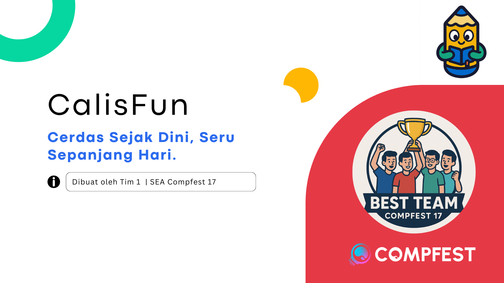

<div align="center">
    <div>
        
    </div>
    <div>
            <h3><b>CalisFun - AI Repository</b></h3>
            <p><i>Cerdas Sejak Dini, Seru Sepanjang Hari</i></p>
    </div>      
</div>
<br>
<h1 align="center">CalisFun - SEA Academy Compfest 17</h1>
<div align="center">



</div>
<br>

CalisFun is an interactive educational app designed to help children learn to read, write, and count in a fun, gamified, and accessible way.

The app offers three main features:

<ul>
<li>✍️ Learn Handwriting – practice writing letters, numbers, and words interactively on a smartphone screen.</li>
<li>🔤 Learn Spelling – spelling games with audio-visual aids.</li>
<li>🔢 Learn Counting – recognize numbers and basic math operations through mini-games.</li>
</ul>

Supported by AI OCR (to automatically recognize children's handwriting) and AI Chatbot (as a friendly virtual tutor), CalisFun aims to reduce illiteracy and make basic learning more fun, adaptive, and inclusive, especially for children in areas with limited access to education.

Further documentation is available at: <a href="">Main Repository</a>

<!-- CalisFun adalah aplikasi edukasi interaktif yang dirancang untuk membantu anak-anak belajar membaca, menulis, dan berhitung dengan cara yang seru, gamified, dan mudah diakses.

Aplikasi ini menghadirkan tiga fitur utama:

<ul>
<li>✍️ Learn Handwriting – latihan menulis huruf, angka, dan kata secara interaktif di layar smartphone.</li>
<li>🔤 Learn Spelling – permainan mengeja kata dengan bantuan audio-visual.</li>
<li>🔢 Learn Counting – pengenalan angka dan operasi matematika dasar melalui mini games.</li>
</ul>

Didukung dengan AI OCR (untuk mengenali tulisan anak secara otomatis) dan AI Chatbot (sebagai tutor virtual yang ramah), CalisFun bertujuan untuk mengurangi angka buta aksara serta menjadikan proses belajar dasar lebih menyenangkan, adaptif, dan inklusif, terutama bagi anak-anak di wilayah dengan keterbatasan akses pendidikan.

Dokumentasi Lebih Lanjut berada di: <a href="">Main Repository</a> -->

---

## 📃 Table of Contents
- [⚙️ Technology Stack](#-technology-stack)
- [🧩 Core Features](#-core-features)
- [🧰 Getting Started Locally](#-getting-started-locally)
- [🔐 .env Configuration](#-env-configuration)
- [👥 Owner](#-owner)
- [📬 Contact](#-contact)

---

## ⚙️ Technology Stack

<div align="center">

<kbd></kbd>
<kbd></kbd>
<kbd></kbd>
<kbd></kbd>
<kbd></kbd>

</div>

<div align="center">
<h4>Python | Flask | Hugging Face | Microsoft Azure | OpenAI</h4>
</div>

---

## 🧩 Core Features

### 🖼️ Image OCR (Microsoft TrOCR)
- Input: file gambar (PNG/JPG) atau base64.
- Output: teks hasil OCR + confidence (opsional) + detil waktu proses.
- Model default: `microsoft/trocr-base-printed`
- Penggunaan: deteksi huruf/kata dari lembar latihan tulis anak atau kartu kosakata.

### 💬 Chatbot (Azure OpenAI Model)
- Input: pertanyaan dari pengguna (bisa tentang apapun)
- Output: respon dari AI Chatbot yang menggunakan model OpenAI-35

---

## 🧰 Getting Started Locally

### Prerequisites
- **Python**
- **Docker** (optional)
- **Git**

### Clone the Project
```bash

# Cloning Repo
git clone https://github.com/best-team-compfest17/CalisFun-AI.git
cd CalisFun-AI

# Make Virtual Environment
python -m venv .venv
source .venv/bin/activate # Windows: .venv\Scripts\activate
pip install -r requirements.txt

# Run the flask api python (in the root folder)
python app.py

# To run the test coverage (in the root folder)
python -m unittest test.py -v
```

---

## 🔐 .env Configuration

.env for the AI
```
AZURE_OPENAI_KEY=...
AZURE_OPENAI_ENDPOINT=https://<your-azure-openai>.openai.azure.com/
AZURE_API_VERSION=2024-06-01 # Example
AZURE_OPENAI_DEPLOYMENT=gpt-35-turbo

PORT=5000
CORS_ALLOW_ORIGINS=*
MAX_UPLOAD_MB=10

TROCR_MODEL_ID=microsoft/trocr-base-printed
MODEL_CACHE_DIR=/app/image-ocr/trocr_cache
```

You can also copy the .env.sample then rename it to .env and update your .env file

---

## 👥 Owner

This Repository is created by Team 1
<ul>
<li>Stanley Nathanael Wijaya - Fullstack Developer</li>
<li>Haikal Iman F - Mobile Developer</li>
<li>Muhammad Favian Jiwani - Mobile Developer</li>
<li>Raditya Ramadhan - Backend Developer</li>
</ul>
As Final Project for SEA Compfest 17 Academy

---

## 📬 Contact
Have questions or want to collaborate?

- 📧 Email: stanley.n.wijaya7@gmail.com
- 💬 Discord: `stynw7`

<code>Made with ❤️ by The Best Team?</code>