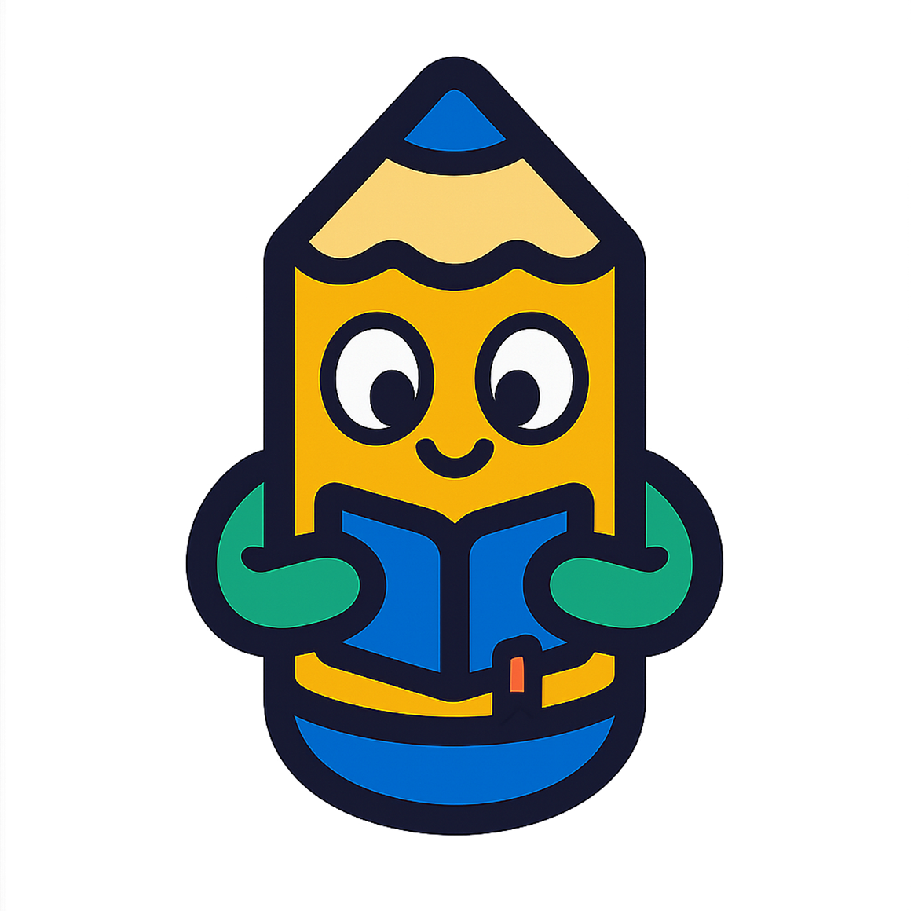

<div align="center">
    <div>
        
    </div>
    <div>
            <h3><b>CalisFun - AI Repository</b></h3>
            <p><i>Gamify, Share, and Learn Together!</i></p>
    </div>      
</div>
<br>
<h1 align="center">CalisFun - SEA Academy Compfest 17</h1>
<div align="center">



</div>
<br>

CalisFun...

<a href="">Main Repository</a>

---

## 📃 Table of Contents
- [⚙️ Technology Stack](#-technology-stack)
- [🧩 Core Features](#-core-features)
- [🧰 Getting Started Locally](#-getting-started-locally)
- [🔐 .env Configuration](#-env-configuration)
- [📸 Website Preview](#-website-preview)
- [🧭 Diagram](#-diagram)
- [👥 Owner](#-owner)
- [📬 Contact](#-contact)

---

## ⚙️ Technology Stack

<div align="center">

<kbd></kbd>
<kbd></kbd>
<kbd></kbd>
<kbd></kbd>
<kbd></kbd>

</div>

<div align="center">
<h4>Python | Flask | Hugging Face | Microsoft Azure | OpenAI</h4>
</div>

---

## 🧩 Core Features

### 📚 Cultural Content Library
- Explore rich content on traditional dances, folktales, artifacts, and culinary heritage
- Multimedia-based content (image, audio, video, narration, ancient script)

### 🧠 Community-Driven Translation
- Users can collaboratively translate cultural assets into local and global languages
- Support for rare scripts: Javanese, Balinese, Dutch Colonial, etc.

### 🕹️ Gamified Learning System
- Learn through missions, quizzes, and streaks
- Earn badges and rank up on cultural knowledge leaderboards

### 🎤 Content Submission Portal
- Anyone can contribute: audio folklore, dialect samples, old manuscripts, or historical photos
- Curated by moderators and experts to ensure quality

### 🌐 Community & Challenges
- Weekly cultural challenges (e.g., “Upload a forgotten legend from your village”)
- Community post board for storytelling, reflection, and cultural sharing

---

## 🧰 Getting Started Locally

### Prerequisites
- **Python**
- **Docker** (optional)
- **Git**

### Clone the Project
```bash
git clone https://github.com/lLAlAlex/Gama.git
cd Gama
cd Frontend
npm install
npm run dev
```

---

## 🔐 .env Configuration

.env for the Backend
```
MONGO_URI=
JWT_SECRET=
PORT=
```

---

## 📸 &nbsp;Website Preview
<table style="width:100%; text-align:center">
    <col width="100%">
    <tr>
        <td width="1%" align="center"></td>
    </tr>
    <tr>
        <td width="1%" align="center">Home Page</td>
    </tr>
    <tr>
        <td width="1%" align="center"></td>
    </tr>
    <tr>
        <td width="1%" align="center">Crafts Page</td>
    </tr>
    <tr>
        <td width="1%" align="center"></td>
    </tr>
    <tr>
        <td width="1%" align="center">Inventory Page</td>
    </tr>
    <tr>
        <td width="1%" align="center"></td>
    </tr>
    <tr>
        <td width="1%" align="center">Play Page</td>
    </tr>
    <tr>
        <td width="1%" align="center"></td>
    </tr>
    <tr>
        <td width="1%" align="center">Journey Recap Page</td>
    </tr>
</table>

---

## 🧭 Diagram

*Overall Database System Flow:*
<p align="center">
  
</p>

This diagram shows how the models connected using ERD Diagram

---

## 👥 Owner

This Repository is created by Team 1
<ul>
<li>Haikal Iman F - Mobile Developer</li>
<li>Muhammad Favian Jiwani - Mobile Developer</li>
<li>Raditya Ramadhan - Backend Developer</li>
<li>Stanley Nathanael Wijaya - Fullstack Developer</li>
</ul>
As Final Project for SEA Compfest 17 Academy

---

## 📬 Contact
Have questions or want to collaborate?

- 📧 Email: stanley.n.wijaya7@gmail.com
- 💬 Discord: `stynw7`

<code>Made with ❤️ by The Best Team?</code>